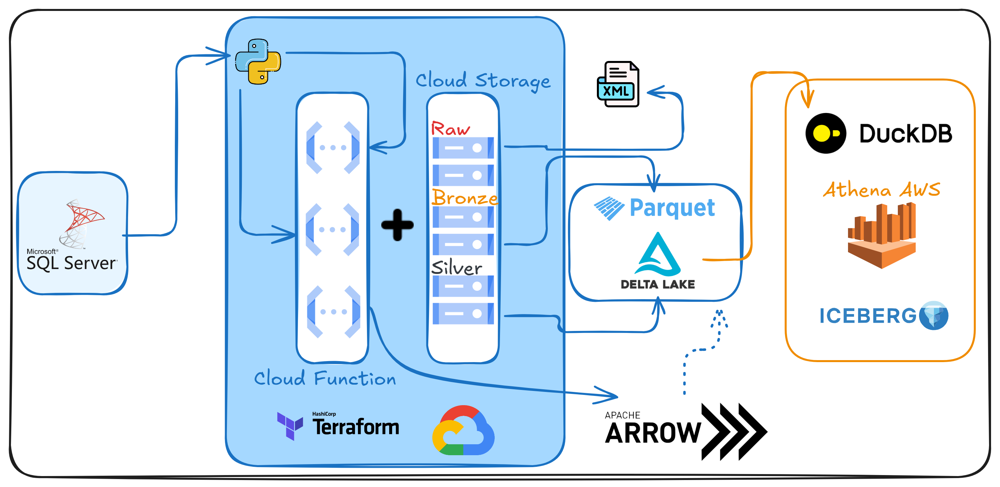

# Projeto de Exportação e Transformação de Dados de Nota Fiscal

Este projeto automatiza o processo de exportação e transformação de dados de XML de notas fiscais para análise no AWS Athena. Toda a infraestrutura é provisionada com **Terraform**, e o pipeline de dados é implementado em **Python** utilizando as bibliotecas `pyodbc`, `deltalake`, `pyarrow`, `duckdb`, e uma biblioteca própria chamada `athena-mvsh`.



## Arquitetura do Projeto

1. **Camada Raw (GCS)**
   - **Objetivo**: Receber os arquivos XML de notas fiscais.
   - **Processo**: Uma Google Cloud Function em Python é acionada quando um novo XML é enviado, carregando-o para um bucket GCS na camada raw e mantendo a estrutura original dos dados.

2. **Camada Bronze (GCS)**
   - **Objetivo**: Converter o XML em formato Parquet para otimizar leitura e armazenamento.
   - **Processo**: Outra Google Cloud Function lê os arquivos XML da camada raw, extrai informações relevantes e converte para Parquet. O arquivo Parquet é então salvo na camada bronze.

3. **Camada Silver (Delta Lake no GCS)**
   - **Objetivo**: Estruturar os dados no formato Delta Lake para histórico e controle de versões.
   - **Processo**: Uma terceira Google Cloud Function lê os arquivos Parquet da camada bronze e os escreve em um Delta Lake, na camada silver, permitindo manipulação de dados robusta.

4. **Exportação para Athena (AWS)**
   - **Objetivo**: Disponibilizar os dados para consulta no AWS Athena em uma tabela Iceberg.
   - **Processo**: Usando `pyarrow` e `duckdb`, o Delta Lake da camada silver é convertido para o formato compatível com Iceberg e transferido para o Athena, onde pode ser consultado diretamente. A biblioteca `athena-mvsh` simplifica as operações de consulta e manipulação no Athena.

## Estrutura de Arquivos e Funções

- `raw_to_bronze.py`: Função para conversão de XML para Parquet.
- `bronze_to_silver.py`: Função para organizar os dados Parquet no Delta Lake.
- `silver_to_athena.py`: Função para exportar o Delta Lake para o AWS Athena.

## Infraestrutura com Terraform

Toda a infraestrutura, incluindo os buckets GCS, as Cloud Functions e permissões, é provisionada usando **Terraform**. O código Terraform configura:

- Buckets do GCS para as camadas raw, bronze e silver
- Cloud Functions com acionadores para cada etapa do processo
- Permissões de interação com o GCS, acesso ao Athena e ao AWS Glue

Para implementar a infraestrutura, basta rodar os comandos do Terraform:

```bash
terraform init
terraform apply
